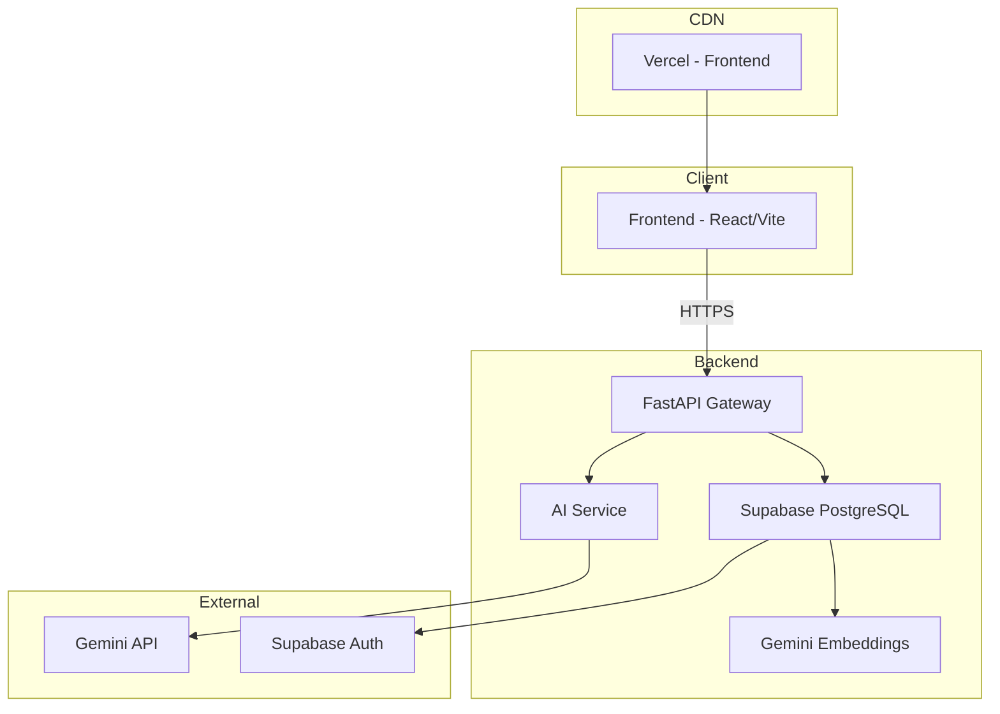
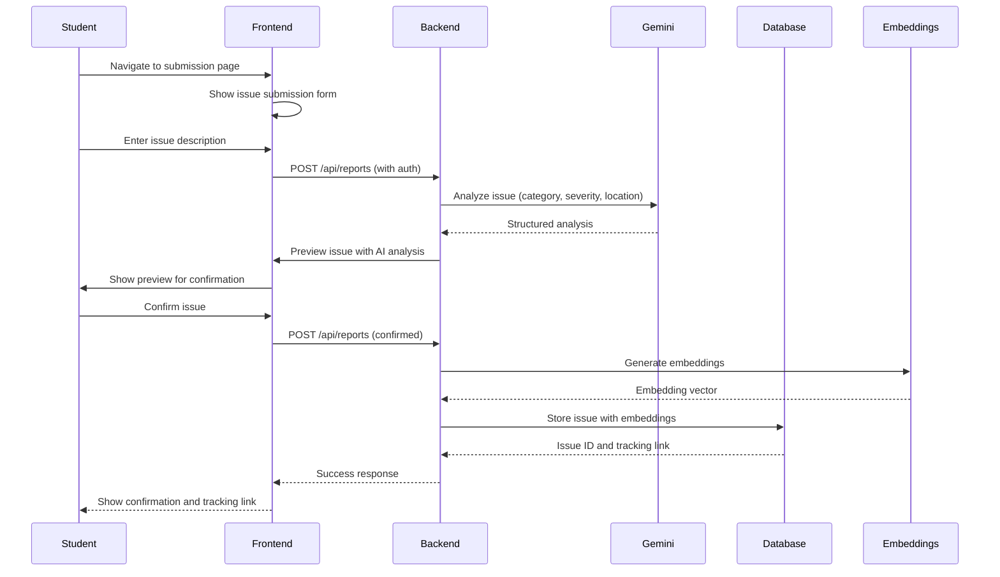

# Technical Design Document

## Overview

CampusLens AI is an AI-powered campus issue intelligence and resolution platform that allows students to submit campus problems using natural language. The AI analyzes each report and transforms unstructured complaints into structured information for university administration.

### System Goals
- Enable students to submit campus issues using natural language descriptions
- Use AI (Gemini API) to analyze, categorize, and prioritize issues
- Provide administrators with a dashboard to view, filter, and manage all reports
- Implement duplicate detection to identify similar issues
- Generate analytics and trend summaries (Campus Pulse)
- Ensure secure authentication and data privacy

### Key Technologies
- **Frontend**: React 18, Vite, Tailwind CSS
- **Backend**: FastAPI (Python)
- **Database**: Supabase PostgreSQL with pgvector for semantic search
- **AI Services**: Google Gemini API for analysis and embeddings
- **Authentication**: Supabase Auth
- **Deployment**: Vercel (frontend), Render (backend)

## Architecture

### High-Level Architecture



### Component Breakdown

```
campuslens-ai/
├── frontend/                    # React + Vite + Tailwind CSS
│   ├── public/
│   ├── src/
│   │   ├── components/         # Reusable UI components
│   │   │   ├── layout/        # Header, Footer, Sidebar
│   │   │   ├── auth/          # Login, Register forms
│   │   │   ├── dashboard/     # Admin dashboard components
│   │   │   ├── reports/       # Issue submission and viewing
│   │   │   └── analytics/     # Charts and statistics
│   │   ├── pages/             # Page components
│   │   ├── services/          # API clients
│   │   ├── hooks/             # Custom React hooks
│   │   ├── utils/             # Helper functions
│   │   └── App.jsx
│   └── vite.config.js
├── backend/                    # FastAPI application
│   ├── main.py                # FastAPI app entry point
│   ├── routes/                # API endpoint definitions
│   │   ├── users.py           # User authentication endpoints
│   │   ├── reports.py         # Issue management endpoints
│   │   └── analytics.py       # Analytics and Campus Pulse
│   ├── services/              # Business logic
│   │   ├── ai_service.py      # Gemini API integration
│   │   ├── database.py        # Database operations
│   │   ├── priority.py        # Priority scoring algorithm
│   │   └── duplicate_detection.py
│   ├── models/                # Pydantic models
│   │   ├── report.py          # Report schema
│   │   └── user.py            # User schema
│   └── requirements.txt
├── .kiro/specs/campuslens-ai/  # Specification files
│   ├── requirements.md
│   ├── design.md              # This file
│   └── tasks.md
└── README.md
```

### Data Flow



## Components and Interfaces

### Frontend Components

#### Authentication Components
- **LoginForm**: Student/admin login with Supabase Auth
- **RegisterForm**: New user registration
- **ProtectedRoute**: Route wrapper for authenticated users
- **AuthContext**: React context for authentication state

#### Layout Components
- **Header**: Navigation and user status
- **Footer**: Copyright and links
- **Sidebar**: Admin dashboard navigation
- **DashboardLayout**: Admin dashboard container

#### Issue Submission Components
- **IssueForm**: Main issue submission form
- **PreviewModal**: AI analysis preview before submission
- **LocationSelector**: Building/zone selection with map integration
- **SuccessAlert**: Submission confirmation

#### Dashboard Components
- **IssueTable**: Sortable table of all issues
- **FiltersPanel**: Category, severity, date range filters
- **IssueDetailsModal**: Detailed issue information view
- **CampusPulse**: AI-generated summary dashboard

#### Analytics Components
- **CategoryChart**: Distribution by category
- **SeverityChart**: Distribution by severity
- **TimeSeriesChart**: Issues over time
- **ExportControls**: CSV export buttons

#### Student Portal Components
- **MyReports**: List of student's submitted issues
- **ReportStatusCard**: Individual issue status display
- **StatusHistory**: Timeline of status changes

### Backend API Endpoints

#### Authentication
```
POST /api/auth/register          # Register new user
POST /api/auth/login             # User login
POST /api/auth/logout            # User logout
GET  /api/auth/session           # Get current session
```

#### Issue Management
```
POST   /api/reports              # Create new report (student)
GET    /api/reports              # List issues (admin)
GET    /api/reports/:id          # Get issue details
PUT    /api/reports/:id          # Update issue (admin)
GET    /api/reports/student/:id  # Get student's reports
```

#### AI Analysis
```
POST   /api/analysis/analyze     # Analyze issue text (admin)
```

#### Analytics
```
GET    /api/analytics/campus-pulse    # Generate Campus Pulse
GET    /api/analytics/summary         # Get summary statistics
GET    /api/analytics/export          # Export analytics to CSV
```

#### Duplicate Detection
```
POST   /api/duplicates/check       # Check for duplicates
GET    /api/duplicates/:id         # Get duplicate list
```

## Data Models

### Database Schema (Supabase)

```sql
-- Users table (Supabase Auth automatically creates this)
-- auth.users contains id, email, role, created_at, etc.

-- Additional profile information
CREATE TABLE profiles (
  id UUID REFERENCES auth.users(id) PRIMARY KEY,
  role TEXT NOT NULL CHECK (role IN ('student', 'admin')),
  created_at TIMESTAMPTZ DEFAULT NOW()
);

-- Reports table
CREATE TABLE reports (
  id UUID DEFAULT gen_random_uuid() PRIMARY KEY,
  student_id UUID REFERENCES auth.users(id) NOT NULL,
  original_description TEXT NOT NULL,
  ai_summary TEXT,
  category TEXT CHECK (
    category IN ('Network', 'Facilities', 'Security', 'Cleanliness', 
                 'Transport', 'Accessibility', 'Academic Facilities', 'Uncategorized')
  ),
  severity TEXT CHECK (severity IN ('Low', 'Medium', 'High', 'Critical')),
  extracted_location TEXT,
  recommended_department TEXT,
  priority_score INTEGER CHECK (priority_score BETWEEN 0 AND 100),
  status TEXT DEFAULT 'Submitted' CHECK (
    status IN ('Submitted', 'Under Review', 'In Progress', 'Resolved', 'Closed')
  ),
  is_safety_flag BOOLEAN DEFAULT FALSE,
  is_accessibility_flag BOOLEAN DEFAULT FALSE,
  duplicate_count INTEGER DEFAULT 0,
  embeddings VECTOR(768),  -- Gemini embedding vector
  created_at TIMESTAMPTZ DEFAULT NOW(),
  updated_at TIMESTAMPTZ DEFAULT NOW()
);

-- Status history table
CREATE TABLE status_history (
  id UUID DEFAULT gen_random_uuid() PRIMARY KEY,
  report_id UUID REFERENCES reports(id) ON DELETE CASCADE,
  previous_status TEXT,
  new_status TEXT NOT NULL,
  changed_by UUID REFERENCES auth.users(id),
  notes TEXT,
  changed_at TIMESTAMPTZ DEFAULT NOW()
);

-- Duplicate relationships table
CREATE TABLE duplicate_relationships (
  id UUID DEFAULT gen_random_uuid() PRIMARY KEY,
  original_report_id UUID REFERENCES reports(id),
  duplicate_report_id UUID REFERENCES reports(id),
  similarity_score FLOAT NOT NULL,
  created_at TIMESTAMPTZ DEFAULT NOW(),
  UNIQUE(original_report_id, duplicate_report_id)
);

-- Campus Pulse cache table
CREATE TABLE campus_pulse_cache (
  id UUID DEFAULT gen_random_uuid() PRIMARY KEY,
  summary JSONB NOT NULL,
  generated_at TIMESTAMPTZ DEFAULT NOW(),
  expires_at TIMESTAMPTZ,
  date_range_start DATE,
  date_range_end DATE
);

-- Create indexes for performance
CREATE INDEX idx_reports_student_id ON reports(student_id);
CREATE INDEX idx_reports_category ON reports(category);
CREATE INDEX idx_reports_severity ON reports(severity);
CREATE INDEX idx_reports_status ON reports(status);
CREATE INDEX idx_reports_priority ON reports(priority_score DESC);
CREATE INDEX idx_reports_created_at ON reports(created_at DESC);
CREATE INDEX idx_reports_embeddings ON reports USING ivfflat (embeddings vector_cosine_ops);

-- Create RLS policies
ALTER TABLE reports ENABLE ROW LEVEL SECURITY;
ALTER TABLE status_history ENABLE ROW LEVEL SECURITY;
ALTER TABLE profiles ENABLE ROW LEVEL SECURITY;

-- RLS policies for reports
CREATE POLICY "Students can view own reports" 
  ON reports FOR SELECT 
  USING (auth.uid() = student_id);

CREATE POLICY "Admins can view all reports" 
  ON reports FOR SELECT 
  USING (EXISTS (
    SELECT 1 FROM profiles 
    WHERE profiles.id = auth.uid() AND role = 'admin'
  ));

CREATE POLICY "Students can insert reports" 
  ON reports FOR INSERT 
  WITH CHECK (auth.uid() = student_id);

CREATE POLICY "Admins can update reports" 
  ON reports FOR UPDATE 
  USING (EXISTS (
    SELECT 1 FROM profiles 
    WHERE profiles.id = auth.uid() AND role = 'admin'
  ));
```

### Pydantic Models

```python
# models/report.py

from pydantic import BaseModel, Field
from typing import Optional, List
from datetime import datetime
from enum import Enum

class Category(str, Enum):
    NETWORK = "Network"
    FACILITIES = "Facilities"
    SECURITY = "Security"
    CLEANLINESS = "Cleanliness"
    TRANSPORT = "Transport"
    ACCESSIBILITY = "Accessibility"
    ACADEMIC_FACILITIES = "Academic Facilities"
    UNCATAGORIZED = "Uncategorized"

class Severity(str, Enum):
    LOW = "Low"
    MEDIUM = "Medium"
    HIGH = "High"
    CRITICAL = "Critical"

class ReportStatus(str, Enum):
    SUBMITTED = "Submitted"
    UNDER_REVIEW = "Under Review"
    IN_PROGRESS = "In Progress"
    RESOLVED = "Resolved"
    CLOSED = "Closed"

class IssueAnalysis(BaseModel):
    summary: str
    category: Category
    severity: Severity
    recommended_department: str
    extracted_location: Optional[str] = None
    safety_flag: bool = False
    accessibility_flag: bool = False
    confidence: float = Field(ge=0.0, le=1.0)

class ReportCreate(BaseModel):
    original_description: str = Field(..., min_length=1, max_length=5000)

class Report(BaseModel):
    id: str
    student_id: str
    original_description: str
    ai_summary: Optional[str] = None
    category: Category
    severity: Severity
    extracted_location: Optional[str] = None
    recommended_department: str
    priority_score: int
    status: ReportStatus
    is_safety_flag: bool
    is_accessibility_flag: bool
    duplicate_count: int
    embeddings: Optional[List[float]] = None
    created_at: datetime
    updated_at: datetime

class ReportDetail(Report):
    student_email: Optional[str] = None
    status_history: List["StatusEntry"] = []
    related_duplicates: List["DuplicateInfo"] = []

class StatusEntry(BaseModel):
    previous_status: Optional[str]
    new_status: str
    changed_by: Optional[str] = None
    changed_by_name: Optional[str] = None
    notes: Optional[str] = None
    changed_at: datetime

class DuplicateInfo(BaseModel):
    id: str
    description: str
    similarity_score: float
    created_at: datetime

# Request/Response models for API
class IssueSubmissionRequest(BaseModel):
    description: str = Field(..., min_length=1, max_length=5000)
    location: Optional[str] = None

class IssueSubmissionResponse(BaseModel):
    success: bool
    report_id: str
    tracking_link: str
    preview: IssueAnalysis

class AnalysisRequest(BaseModel):
    text: str = Field(..., min_length=1, max_length=10000)

class AnalysisResponse(BaseModel):
    analysis: IssueAnalysis
    warning: Optional[str] = None

class FilterParams(BaseModel):
    category: Optional[Category] = None
    location: Optional[str] = None
    severity: Optional[Severity] = None
    status: Optional[ReportStatus] = None
    department: Optional[str] = None
    start_date: Optional[datetime] = None
    end_date: Optional[datetime] = None
    page: int = Field(default=1, ge=1)
    page_size: int = Field(default=20, ge=1, le=100)

class CampusPulseResponse(BaseModel):
    top_categories: List[dict]
    top_locations: List[dict]
    severity_distribution: dict
    priority_summary: dict
    emerging_trends: List[str]
    date_range: dict
    generated_at: datetime
    cached: bool = False
```

## Correctness Properties

*A property is a characteristic or behavior that should hold true across all valid executions of a system-essentially, a formal statement about what the system should do. Properties serve as the bridge between human-readable specifications and machine-verifiable correctness guarantees.*

### Property 1: Issue Analysis Consistency

*For any* valid issue description, the AI analysis should consistently categorize semantically similar issues into the same category and assign matching severity levels when the content is unchanged.

**Validates: Requirements 4.1, 4.2, 4.3**

### Property 2: Priority Score Calculation

*For any* report, the priority score should be correctly calculated using the deterministic formula: base score from severity (Low=25, Medium=50, High=75, Critical=100) plus up to 20 points for duplicates, 15 points for open >7 days, 20 points for safety flag, and 15 points for accessibility flag.

**Validates: Requirements 12.1, 12.2, 12.3, 12.4, 12.5, 12.6, 12.7**

### Property 3: Duplicate Detection Threshold

*For any* new report and existing reports, if the cosine similarity of embeddings exceeds 0.85, the system should flag the new report as a potential duplicate and increment the duplicate count.

**Validates: Requirements 13.1, 13.2, 13.3**

### Property 4: Report Status Transition Validity

*For any* report status change request, only valid transitions should be allowed: Submitted→Under Review, Under Review→In Progress, In Progress→Resolved, Resolved→Closed, and In Progress→Closed.

**Validates: Requirements 8.1**

### Property 5: Duplicate Count Accuracy

*For any* report, the duplicate count should accurately reflect the number of reports that have been flagged as duplicates of this report.

**Validates: Requirements 13.3**

### Property 6: Campus Pulse Caching

*For any* Campus Pulse generation request within 30 minutes of a previous request with the same date range, the system should return the cached result.

**Validates: Requirements 16.5**

### Property 7: User Authorization Enforcement

*For any* API request, only authenticated users with appropriate roles should be able to access resources: students can only view their own reports, while administrators can view all reports.

**Validates: Requirements 1.5, 3.2, 9.2**

## Error Handling

### Error Categories

#### Authentication Errors
- `401 Unauthorized`: Invalid or expired authentication token
- `403 Forbidden`: User lacks required role (admin-only endpoint)
- `400 Bad Request`: Missing authentication credentials

#### Validation Errors
- `400 Bad Request`: Invalid input data (empty description, invalid category)
- `422 Unprocessable Entity`: Failed to parse or validate request body

#### API Service Errors
- `503 Service Unavailable`: Gemini API unavailable
- `429 Too Many Requests`: Gemini API rate limit exceeded
- `502 Bad Gateway`: External service timeout

#### Database Errors
- `500 Internal Server Error`: Database connection failure
- `409 Conflict`: Duplicate constraint violation
- `504 Gateway Timeout`: Database query timeout

### Error Handling Strategy

```python
# Backend error handling structure

class AppError(Exception):
    """Base exception for application-specific errors"""
    def __init__(self, message: str, status_code: int = 500, details: dict = None):
        self.message = message
        self.status_code = status_code
        self.details = details or {}
        super().__init__(self.message)

class AuthenticationError(AppError):
    def __init__(self, message: str = "Authentication required"):
        super().__init__(message, 401)

class AuthorizationError(AppError):
    def __init__(self, message: str = "Insufficient permissions"):
        super().__init__(message, 403)

class ValidationError(AppError):
    def __init__(self, message: str, field_errors: dict = None):
        super().__init__(message, 422)
        self.field_errors = field_errors or {}

class GeminiError(AppError):
    def __init__(self, message: str, original_error: Exception = None):
        super().__init__(message, 503)
        self.original_error = original_error

class DatabaseError(AppError):
    def __init__(self, message: str, original_error: Exception = None):
        super().__init__(message, 500)
        self.original_error = original_error
```

### Fallback Strategies

#### Gemini API Unavailable
1. Log the error and increment monitoring metrics
2. Return a warning to the user: "AI analysis temporarily unavailable"
3. Use keyword-based classification with predefined rules:
   - Search for keywords like "internet", "wifi", "network" → Network category
   - Search for keywords like "broken", "broken", "leak", "damaged" → Facilities category
   - Search for keywords like "dangerous", "unsafe", "threat" → Security category
   - Default to "Uncategorized" with Low severity
4. Allow issue submission without AI analysis

#### Embedding Generation Failure
1. Log the error and continue with basic text matching
2. Skip duplicate detection for this issue
3. Log a warning for admin review
4. Allow issue submission without duplicate check

#### Database Connection Failure
1. Attempt automatic reconnection (3 retries with exponential backoff)
2. Return 503 Service Unavailable with retry-after header
3. Log the error with full stack trace
4. For critical operations, implement circuit breaker pattern

### User-Facing Error Messages

| Error Type | User Message | Action |
|------------|--------------|--------|
| Authentication Error | "Please log in to continue" | Redirect to login |
| Authorization Error | "You don't have permission to access this resource" | Redirect to home |
| Validation Error | "Please check your input and try again" | Highlight invalid fields |
| Gemini Error | "We're experiencing technical difficulties analyzing your issue. Please try again in a few minutes." | Retry |
| Database Error | "We're having trouble saving your issue. Please try again." | Retry |

## Testing Strategy

### Test Types

#### Unit Tests
- Test individual functions in isolation
- Verify business logic correctness
- Mock external dependencies (Gemini API, Database)

#### Integration Tests
- Test API endpoint behavior
- Verify database operations
- Test authentication flow

#### Property-Based Tests
- Test universal properties across all inputs
- Verify priority score calculations
- Test duplicate detection threshold
- Test status transition rules

#### End-to-End Tests
- Test complete user flows
- Verify UI rendering
- Test authentication and authorization

### Testing Framework

- **Unit Tests**: pytest with pytest-asyncio
- **Property-Based Tests**: Hypothesis library
- **Integration Tests**: pytest with test database
- **E2E Tests**: Playwright or Cypress

### Test Configuration

#### Unit Test Example
```python
# tests/test_priority.py
from hypothesis import given, strategies as st
from backend.services.priority import calculate_priority_score

@given(severity=st.sampled_from(['Low', 'Medium', 'High', 'Critical']),
       duplicate_count=st.integers(min_value=0, max_value=10),
       days_open=st.integers(min_value=0, max_value=30),
       safety_flag=st.booleans(),
       accessibility_flag=st.booleans())
def test_priority_score_calculation(severity, duplicate_count, days_open, safety_flag, accessibility_flag):
    """Property: Priority score follows the deterministic formula"""
    score = calculate_priority_score(severity, duplicate_count, days_open, safety_flag, accessibility_flag)
    assert 0 <= score <= 100
    # Test base scores
    base_scores = {'Low': 25, 'Medium': 50, 'High': 75, 'Critical': 100}
    expected_base = base_scores[severity]
    assert score >= expected_base
    # Test maximum scores
    max_bonus = 20 + 15 + 20 + 15  # duplicates + days + safety + accessibility
    assert score <= expected_base + max_bonus
```

#### Property-Based Test Configuration
- Minimum 100 iterations per property
- Hypothesis max_examples=100
- Each test tagged with **Feature: campuslens-ai, Property {number}: {property_text}**

### Test Coverage Goals

- **Unit Tests**: 80%+ code coverage
- **Integration Tests**: Cover all API endpoints
- **Property-Based Tests**: Cover all testable acceptance criteria
- **E2E Tests**: Cover critical user flows

### Manual Testing Checklist

- [ ] Student registration and login
- [ ] Issue submission with AI analysis
- [ ] Issue preview and confirmation
- [ ] Issue tracking for students
- [ ] Admin dashboard access
- [ ] Issue filtering and sorting
- [ ] Status updates
- [ ] Campus Pulse generation
- [ ] Duplicate detection
- [ ] Analytics export
- [ ] Responsive design on mobile/tablet/desktop